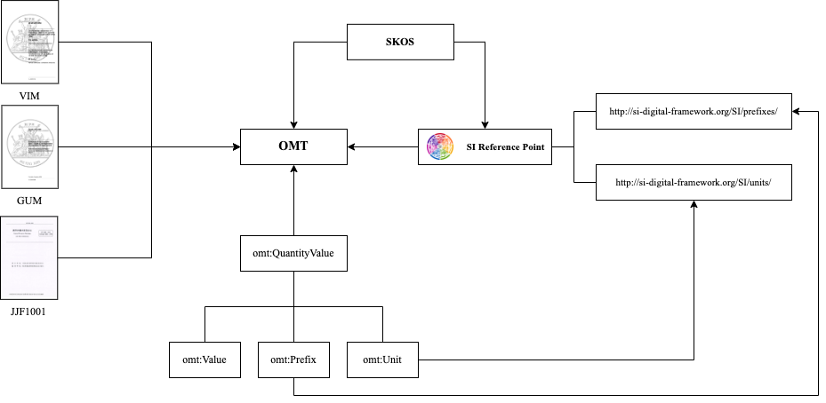
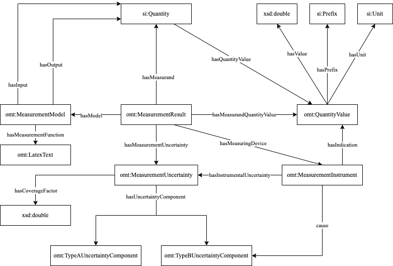

# OMT v1.1.0: Ontology for Measurement Terminology

## What is OMT?
Ontology for Measurement Terminology (OMT) is a domain ontology, using a foundation of metrological terms from standards like International Vocabulary of Me-trology (VIM), Guide to the Expression of Uncertainty in Measurement (GUM), and JJF 1001-2011. It also incorporates insights from models such as the SI Reference Point, the Simple Knowledge Or-ganization System (SKOS), and the DCC Schema.

## Contextual Relationships

## Relationships of Core Concepts
